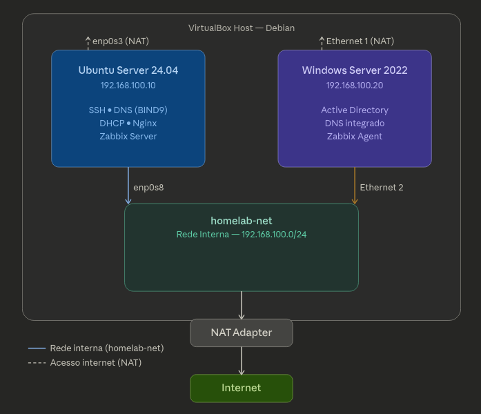

# HomeLab - Infraestrutura & Redes

Laboratório virtual criado para estudo prático de infraestrutura, redes, sistemas e automação. 
O objetivo deste projeto é simular um ambiente corporativo real, permitindo praticar administração de servidores, serviços de rede, monitoramento e troubleshooting.

🎯 Objetivos do Projeto

• Praticar administração Linux e Windows; 
• Configurar serviços de rede essenciais; 
• Aprender monitoramento de infraestrutura; 
• Simular cenários reais de empresas; 
• Documentar aprendizados para portfólio profissional. 
  Este laboratório é atualizado constantemente conforme novos serviços e tecnologias são estudados.

🧱 Infraestrutura do Laboratório

O ambiente roda em máquinas virtuais usando virtualização local.

🖥️ Hypervisor

VirtualBox

🧰 Sistemas Operacionais

Ubuntu Server 24.04 
Windows Server 2022

🌐 Topologia da Rede

⚙️ Tecnologias Utilizadas

• Linux; 
• Windows Server; 
• Bash; 
• Python; 
• VirtualBox; 
• BIND9; 
• Nginx; 
• Zabbix; 
• Active Directory.

📊 Habilidades Praticadas

• Administração de servidores Linux; 
• Administração Windows Server; 
• Networking; 
• Troubleshooting; 
• Automação; 
• Monitoramento.

👨‍💻 Autor

Projeto criado para estudo e evolução profissional em Infraestrutura, Redes e Cloud.

GitHub: https://github.com/IanBd00

⭐ Este projeto faz parte do meu portfólio de estudos em infraestrutura.
